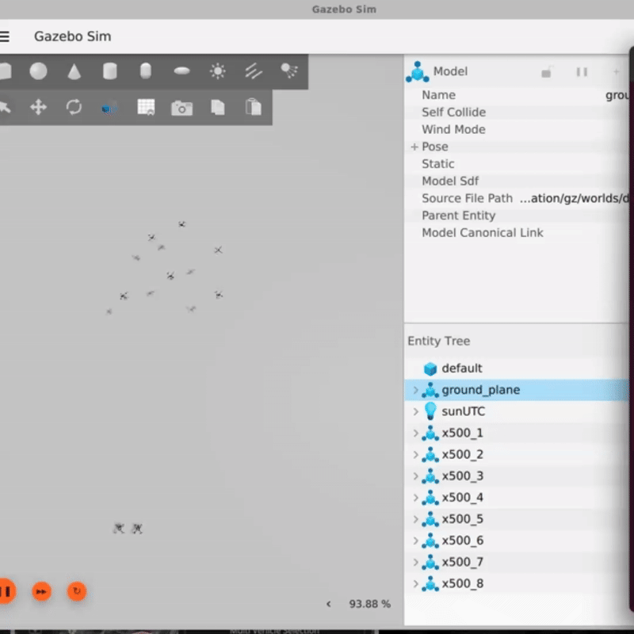
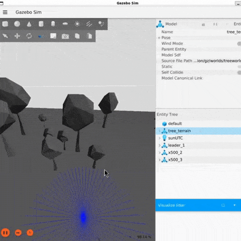

# Multi-Drone-PX4-RL
A toolkit to spawn multiple PX4 simulated drones, design formations with a simple drawing canvas, and control the swarm either manually (keyboard) or automatically with a trained RL leader.

## Features

### Formation Flight 
- Draw custom formations using an interactive OpenCV canvas.
- Convert drawings into 3D drone positions (drone_points.json).
- Automatically distribute drones into those positions.


### Reinforcement Learning Integration
- Deploy trained models into Gazebo/ROS 2 for realistic testing.



### ROS 2 + PX4 Integration

- Uses px4_ros_com and px4_msgs for communication.
- Supports multi-drone simulation with PX4 SITL and Gazebo Harmonic.

### Visualization Tools

- LiDAR data bridging from Gazebo → ROS 2 topics.
- RViz integration to inspect pointclouds.

### Control Modes

- Manual mode: WASD / IJKL keyboard control via sshkeyboard.
- Autonomous mode: RL-based agent navigation.


### Pre-requisites
- Make sure you have PX4-Autopilot, Gazebo and ROS2 installed. If not done, you can follow this guide here which also includes some examples for flying x500 PX4 Drones in this repository [px4_ros2_ws](https://github.com/DevashishHarsh/px4_ros2_ws/tree/main).

## Setup
I have created this project with minimal setup ( if you have followed the other tutorial ). 
1. Copy the repository onto your device.
```
cd
git clone https://github.com/DevashishHarsh/Multi-Drone-PX4-RL.git
```
2. Create a virtual environment and install all the necessary modules.
```
python3 -m venv venv
source venv/bin/activate #Activates the virtual environment
cd Multi-Drone-PX4-RL
pip install -r requirements.txt
```
> I have also included a [setup.sh](setup.sh) file which installs everything ( PX4-Autopilot, QGroundControl, ROS2 ) that is required but I would suggest you install everything manually.
```
chmod +x setup.sh
./setup.sh
source ~/.bashrc
```
3. Run the draw.py to create drone points for formation ( refer to [px4_ros2_ws](https://github.com/DevashishHarsh/px4_ros2_ws) )
```
cd Multi-Drone-PX4-RL/points
python3 draw.py
```
> You will be prompted to enter the number of drones. Keep the number upto 10 as more drones takes a lot of memory space.

4. Run launch.py that spawns the drones ( along with the leader that has the lidar sensor ) according to the number of drones and number of formations you chose in Step 3.
```
cd Multi-Drone-PX4-RL
python3 launcy.py
```
This command has two args 
- -p --points : Define the path to drone_points.json file or directory containing it.
- -w --world : Name of the Gazebo world to use (PX4_GZ_WORLD). Default: 'default'.
> I have planned to launch some custom worlds for testing soon.

5. Run visual.py in a new terminal that converts gazebo topics to ros2 topics for lidar so that you can use lidar points in the code.
```
cd Multi-Drone-PX4-RL
python3 visual.py
```
This command has three args 
- -d --drone : Drone model name that contains the lidar sensor (e.g. leader_1 or x500_0). Default: 'leader_1'.
- -w --world : Name of the Gazebo world to use (PX4_GZ_WORLD). Default: 'default'.
- -v --visual : Whether to open rviz (1) or not (0). Default: 0.
> I have included an extra script [leader_rl.py](checks/leader_rl.py) in which only one leader drone is spawned to test lidar and other functions.

6. Source all the necessary files if you haven't done them already.
```
cd px4_ros2_ws
source install/setup.bash
source /opt/ros/jazzy/setup.bash
```
> Make sure you have installed the repository [px4_ros2_ws](https://github.com/DevashishHarsh/px4_ros2_ws) as it contains the required "px4_msgs" and "px4_ros_com" repos as well.
> Add these to your .bashrc file so that you don't need to source them everytime you open a terminal

8. Run rundrone.py in a new terminal that controls the spawned drones in gazebo for formation in manual and auto modes.
```
cd Multi-Drone-PX4-RL
python3 rundrone.py
```
This command has three args 
- -m --modelfile : Path to directory containing model.zip and model_vector.pkl (default: ./model next to this script).
- -d --device : Device to load model on ('cpu' or 'cuda'). Default: cpu.
- -p --points : Path to drone_points.json file or directory containing it. Default: ./points/drone_points.json next to this script.

## Modes
### Manual Mode 
The manual mode, as the name suggests lets you control the leader drone while the follower drones keep an offset with you which lets you control the whole formation indirectly. You can enter the manual mode with "manual" command.
#### Controls in Manual Mode
- W,A,S,D - Movement control
- I,K - Altitude control
- J, L - Yaw control
- N - Next formation in the list
- Z - Exit Manual mode to Main Menu

### Auto Mode
The auto mode uses the SAC Model to control the drone based on P2P mode ( Point to Point ). It calculates the velocity to reach the given goal point and also utilizes lidar points to avoid the obstacles in the path, thus successfully showcasing path planning and obstacle avoidance. You can enter the auto mode with "auto" command.
> The model has been trained with another repository [DroneRL](https://github.com/DevashishHarsh/DroneRL). You can check it out to train your own model for the drone control and to understand the model's working.
#### Controls in Auto Mode
- move X Y : Moves to (X,Y) [(Y, X) in Gazebo Axes] using the SAC Model and predicting the velocity commands with the provided obs. 
- n - Next formation in the list
- z - Exit Auto mode to Main Menu

## Side Note
I have just worked on this so I will be adding more scripts to this repository and fixing the bugs to make it robust. The model, as of now is 86% Accurate ( Tested over 100 episodes ). 

## License
This repository is provided under the MIT License.


